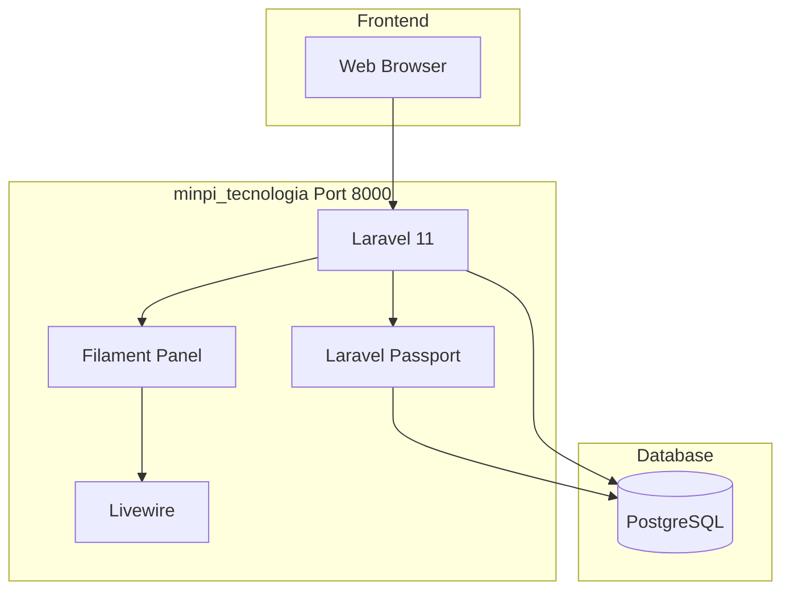
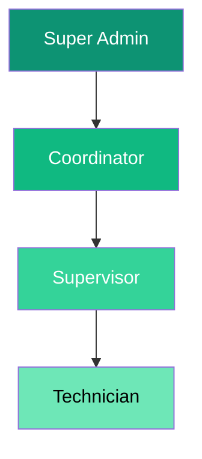

## System Architecture

The system follows a modern decoupled architecture where the API and Admin Panel (Filament) consume a centralized database, while authentication is handled via OAuth2.


---

## OAuth2 Authentication System
The system uses Laravel Passport to implement OAuth2 locally, acting as both an OAuth server and client.

**Authentication Flow**

```mermaid
sequenceDiagram
    participant U as User
    participant T as minpi_tecnologia
    participant O as OAuth Server
    
    U->>T: Access /login
    T->>O: Redirect to /oauth/authorize
    O->>U: Authorization page
    U->>O: Approve access
    O->>T: Callback with code
    T->>O: Exchange for token
    O->>T: Access Token + Refresh Token
    T->>U: Access Dashboard

<Note>
The PASSPORT_CLIENT_ID and PASSPORT_CLIENT_SECRET values must be provided by the external OAuth server if one is used in production.
</Note>
```

---

## Roles and Permissions (RBAC)
Security is enforced using Filament Shield and Spatie Permission, ensuring dynamic access policies based on the principle of least privilege.

**Role Hierarchy**



<AccordionGroup>
<Accordion title="Super Admin" icon="crown">
Full system access. Can manage all resources, users, and configure dynamic roles.
</Accordion>
<Accordion title="Coordinator" icon="building">
Management access (no delete). Manages equipment, assignments, and offices.
</Accordion>
<Accordion title="Supervisor" icon="eye">
Supervision access. Monitors technicians and support tickets.
</Accordion>
<Accordion title="Technician" icon="wrench">
Basic access. Can only read and update their assigned support tickets.
</Accordion>
</AccordionGroup>

---

## Admin Panel (Filament)
The administrative interface is built with Filament v3, providing a reactive SPA-like experience using Livewire and Alpine.js.

**Key Resources**:

- `ComputadoraResource`: Computer management with CRUD, Filters, Export, and Activity Timeline.

- `SoporteResource`: Support tickets management with States and Priorities.

- `ActivityResource`: Read-only forensic logs interface.