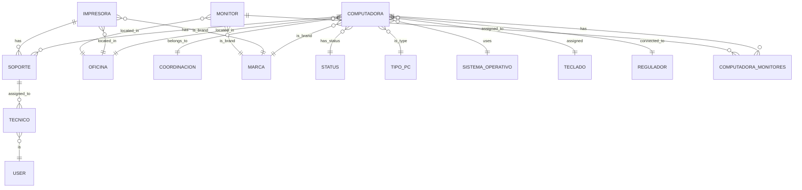

## Entity-Relationship Diagram

The database is built on **PostgreSQL 14+** and handles intricate connections between hardware, components, locations, and support tickets.



## Core Models Implementation
The system uses Laravel's Eloquent ORM with over 28 strictly typed models.

<CodeGroup>

```php
// app/Models/Computadora.php
class Computadora extends Model
{
    use HasFactory, SoftDeletes, LogsActivity;
    protected $fillable = [
        'tipo_pc_id', 'marca_id', 'modelo', 'serial',
        'numero_bien', 'procesador', 'memoria_ram',
        'ip', 'mac', 'status_id', 'oficina_id'
        // ...
    ];

    // Relationships
    public function oficina(): BelongsTo {}
    public function marca(): BelongsTo {}
    public function monitores(): BelongsToMany {}
    public function soportes(): HasMany {}
}
```

```php
// app/Models/Soporte.php
class Soporte extends Model
{
    protected $fillable = [
        'titulo', 'descripcion', 'estado', 
        'prioridad', 'categoria', 'oficina_id',
        'computadora_id', 'finalizado'
    ];

    // Accessors & Scopes
    public function getEstaAtrasadoAttribute(): bool {}
    public function scopeEsteMes($query) {}
    public function scopeAtrasados($query) {}
}
```

</CodeGroup>

## Database Seeders & Factories
To facilitate testing and deployment, the system includes comprehensive seeders and factories:

- `RolesSeeder`: Creates basic roles and permissions.

- `FactoriesSeeder`: Generates massive test data (Computers, Printers, Tickets) using Faker.

- **Catalog Seeders**: Pre-fills operational statuses, brands, OS versions, and hardware types.