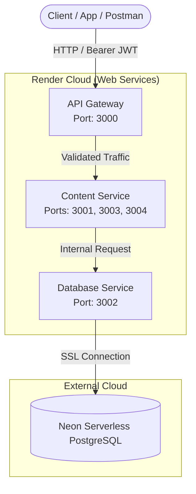
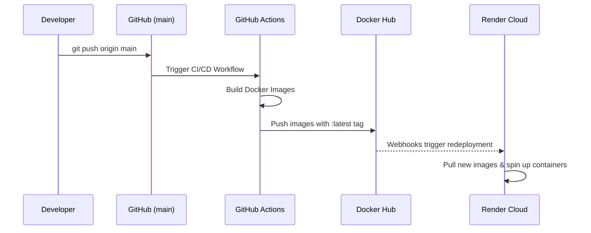

## System Architecture

The application transitions from a traditional monolith to a distributed architecture. It uses an **API Gateway** pattern where the main API Service acts as the single entry point, handling security before routing traffic to internal containerized services.

<Note>
Multi-Process Container Optimization: To optimize cloud resources on Render's free tier, the Content Service runs multiple Node.js processes (Posts, Follows, Likes) within a single Docker container using a shell script orchestration.
</Note>

---

## Service Distribution

The ecosystem is divided into specific domain-driven services:

| Service Name | Environment | Port | Primary Responsibility |
| :--- | :--- | :--- | :--- |
| **api-service** | Docker (Render) | `3000` | Auth validation, Users management, and request routing. |
| **content-service** | Docker (Render) | `3001, 3003, 3004` | Handles Posts, Follows, and Likes logic. |
| **db-service** | Docker (Render) | `3002` | Abstracted database access layer. |

---

## CI/CD Pipeline (GitHub Actions)

The deployment strategy is fully automated and vendor-agnostic. Every push to the `main` branch triggers a workflow that builds the microservices into Docker images and pushes them to a centralized registry.

Infrastructure Stack
<CardGroup cols={2}>
<Card title="Compute" icon="cloud">
Render: Hosts the containerized web services, automatically pulling the latest images from Docker Hub.
</Card>
<Card title="Database" icon="database">
Neon: Provides a highly available, serverless PostgreSQL instance with persistent storage.
</Card>
<Card title="Container Registry" icon="docker">
Docker Hub: Acts as the centralized repository for all built microservice images.
</Card>
<Card title="Automation" icon="github">
GitHub Actions: Handles the continuous integration and delivery pipeline securely using repository secrets.
</Card>
</CardGroup>