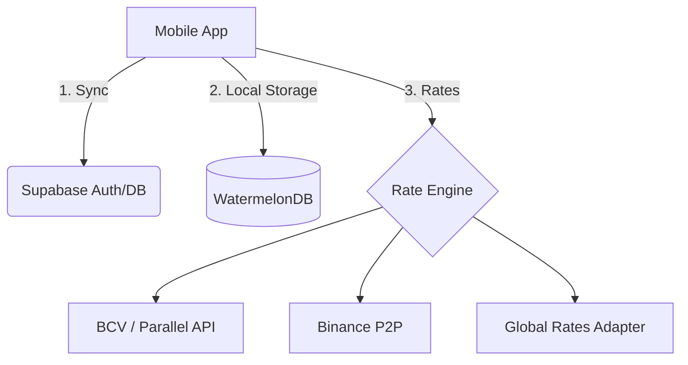

## Architecture Overview

Capital Flux follows a **Decoupled Client-Server** architecture with a heavy emphasis on client-side state management to support offline operations.

### Data Flow Diagram

---

### Components

1. **Core Mobile Client:** Built with React Native, it handles the UI and optimistic updates.

2. **Rate Engine:** A sophisticated adapter that fetches, normalizes, and caches exchange rates every 30 minutes.

3. **Sync Engine:** Manages a mutation queue to ensure data consistency between the local SQLite database and Supabase.

4. **Global Rates Adapter:** Integrated in Phase 11 to provide seamless conversion for international currency pairs (USD, EUR, COP, etc.) via `open.er-api.com`.