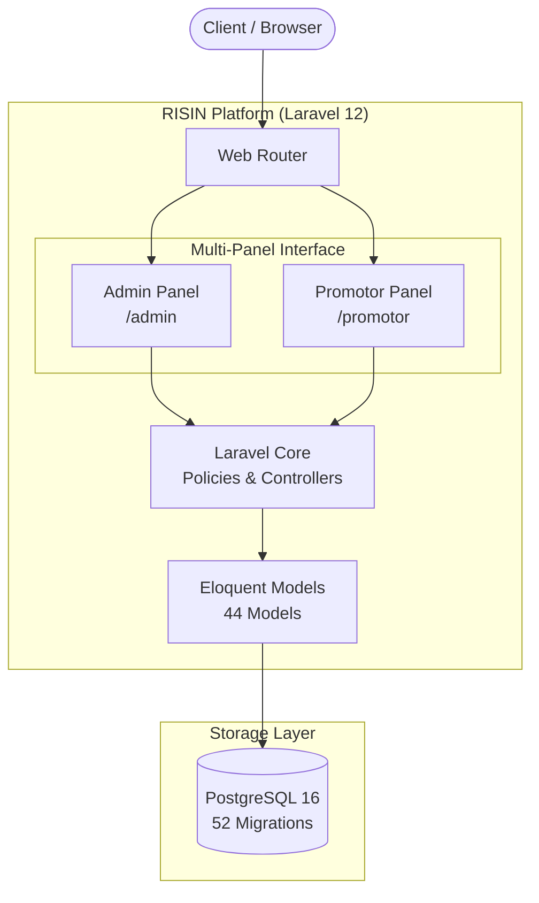
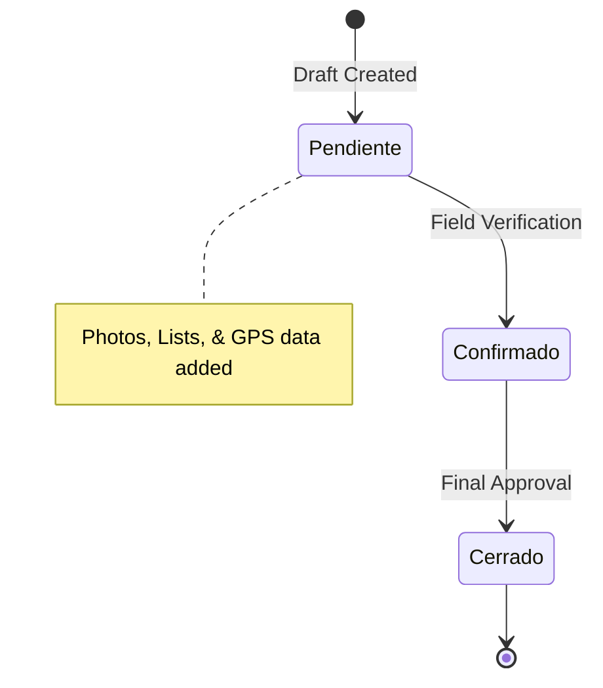
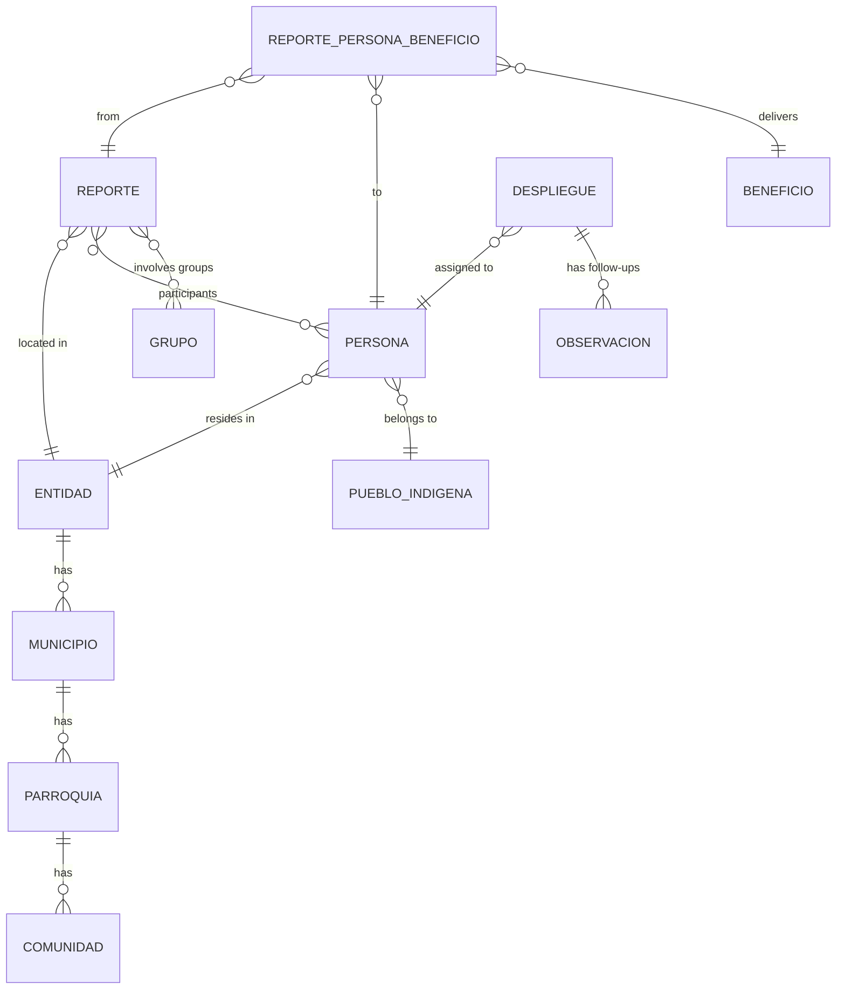

## High-Level Architecture

RISIN is built on a modern **Laravel 12** foundation, utilizing **Filament 3.3** for its rapid administration interfaces and **PostgreSQL 16** to handle complex geographic and demographic relationships.

---

## Multi-Panel & Authorization
The system operates with a **Multi-Panel Architecture** to separate concerns between field workers and regional administrators. Access is strictly governed by `spatie/laravel-permission` and **31 custom Policy classes**.

<CardGroup cols={2}>
<Card title="Admin Panel (/admin)" icon="user-tie">
Full administration panel for `super_admin`, `director`, and analytical roles. Data is dynamically scoped to the user's assigned federal entities.
</Card>
<Card title="Promotor Panel (/promotor)" icon="users-viewfinder">
A streamlined, amber-themed panel designed specifically for field promoters. Users here can only interact with their own created reports and deployments.
</Card>
</CardGroup>

---

## Core Domain Modules
The platform's business logic is divided into highly relational modules that track the lifecycle of social inclusion.

**1. Geographic Engine**

Venezuela's 4-level political-administrative division (Entity -> Municipality -> Parish -> Community) is mapped using official INE codes. A parallel geographic layer exists for MINPI's specific indigenous territorial mapping.

**2. Person Registry (Persona)**

The central entity of the system. Captures comprehensive profiles including demographics, education, and vulnerabilities (pregnancy, malnutrition, disabilities, homelessness). Features SoftDeletes and inline tracking of historical benefits.

**3. Report & Benefit Engine**

Field activities are recorded as Reporte instances. These reports act as the junction point where **Persons**, **Organized Groups**, and specific **Benefits** meet.

---

## Entity-Relationship Diagram (ERD)
The database schema is highly normalized. Below is a simplified representation of how geographic locations, people, and benefit distributions are interconnected through the Report engine.

## Security & Auditing
To maintain absolute data integrity for government reporting, RISIN implements **Spatie Activity Log**. Every creation, update, or deletion across critical models (especially the 18 fillable fields of a Report) is permanently recorded with the user's ID, timestamp, and a before/after snapshot of the data.