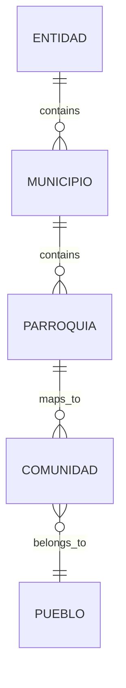

## Data Modeling Overview

The RISIN database is engineered for high integrity and scalability, featuring **52 migrations** and **44 Eloquent models**. Built on **PostgreSQL 16**, the schema is designed to handle thousands of social records while maintaining strict relational consistency.

---

## The Central Entity: `personas`

The `personas` table is the heart of the system. It uses a UUID-primary key strategy for secure identification and stores comprehensive socio-demographic data.

### Key Attributes
* **Identification:** Standard National ID (*Cédula*) with unique constraints.
* **Vulnerability Flags:** Boolean indicators for high-impact tracking (Malnutrition, Pregnancy, Disability, Homelessness).
* **Cultural Identity:** Polymorphic-like relations to Indigenous Peoples (*Pueblos*) and Communities.
* **Integrity:** Implements `SoftDeletes` across all citizen-related tables to prevent accidental data loss.

---

## Geographic & Territorial Mapping

One of the system's most complex features is the dual geographic layer. It allows reporting based on official political divisions and MINPI's specific territorial organization.

| Level | Table Name | Source | Key Features |
| :--- | :--- | :--- | :--- |
| **State** | `entidades` | INE | Official ISO-like codes. |
| **Municipality** | `municipios` | INE | Linked to federal entities. |
| **Parish** | `parroquias` | INE | Smallest official political unit. |
| **Community** | `comunidades` | MINPI | Custom mapping for indigenous settlements. |

---

## Transactional Architecture: The Report Engine
The system avoids "flat" tables for benefits. Instead, it uses a centralized `reportes` table that connects multiple entities through many-to-many relationships.

**Many-to-Many Relationships**

* **Participants:** `reporte_persona` tracks every citizen present during a social deployment.

* **Benefit Distribution:** `reporte_persona_beneficio` is the most granular table, linking a specific Report, a Person, and the Benefit received (e.g., medical aid, food, tools).

* **Infrastructure:** `reporte_grupo` links deployments to organized community groups like Communal Councils.

---

## Auditing & System Logs
To comply with government transparency standards, every single change in the database is audited using Spatie Activity Log.

* **Fillable Tracking:** The system monitors 18 critical fields in the `reportes` table.

* **History:** Administrators can view "Before" and "After" snapshots of any record directly from the Filament interface.

* **Performance:** Indexes are strategically placed on `cedula`, `uuid`, and foreign keys (`entidad_id`, `parroquia_id`) to ensure sub-second query response times even with large datasets.